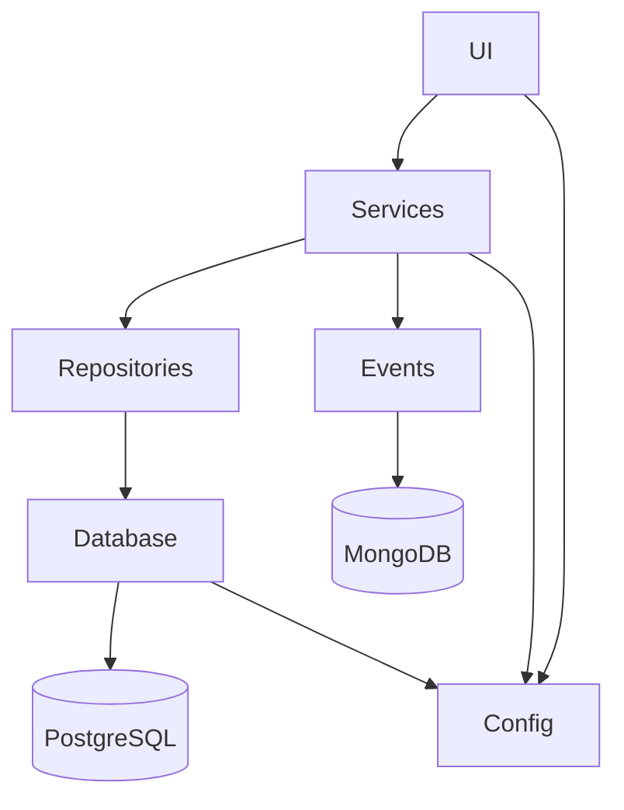

# SmartLibrary - Arquitetura Geral

```mermaid
flowchart TD
    UI["UI"]
    SERVICES["Services"]
    REPOSITORIES["Repositories"]
    DATABASE["Database"]
    CONFIG["Config"]
    EVENTS["Events"]
    POSTGRES[("PostgreSQL")]
    MONGODB[("MongoDB")]

    UI --> SERVICES
    SERVICES --> REPOSITORIES
    REPOSITORIES --> DATABASE
    DATABASE --> POSTGRES
    SERVICES --> EVENTS
    EVENTS --> MONGODB
    UI --> CONFIG
    SERVICES --> CONFIG
    DATABASE --> CONFIG
```
