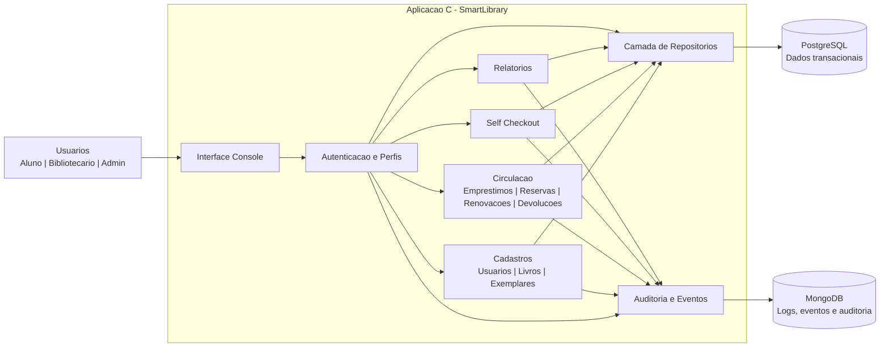

# SmartLibrary - Arquitetura Resumida

## Leitura Rapida

- A aplicacao principal e escrita em C e exposta por interface console.
- O PostgreSQL concentra os dados transacionais: usuarios, perfis, livros, exemplares, emprestimos, reservas e devolucoes.
- O MongoDB registra eventos operacionais, logs e trilhas de auditoria.
- A camada de repositorios isola o acesso ao banco relacional.
- O modulo de auditoria recebe eventos dos principais fluxos do sistema.
