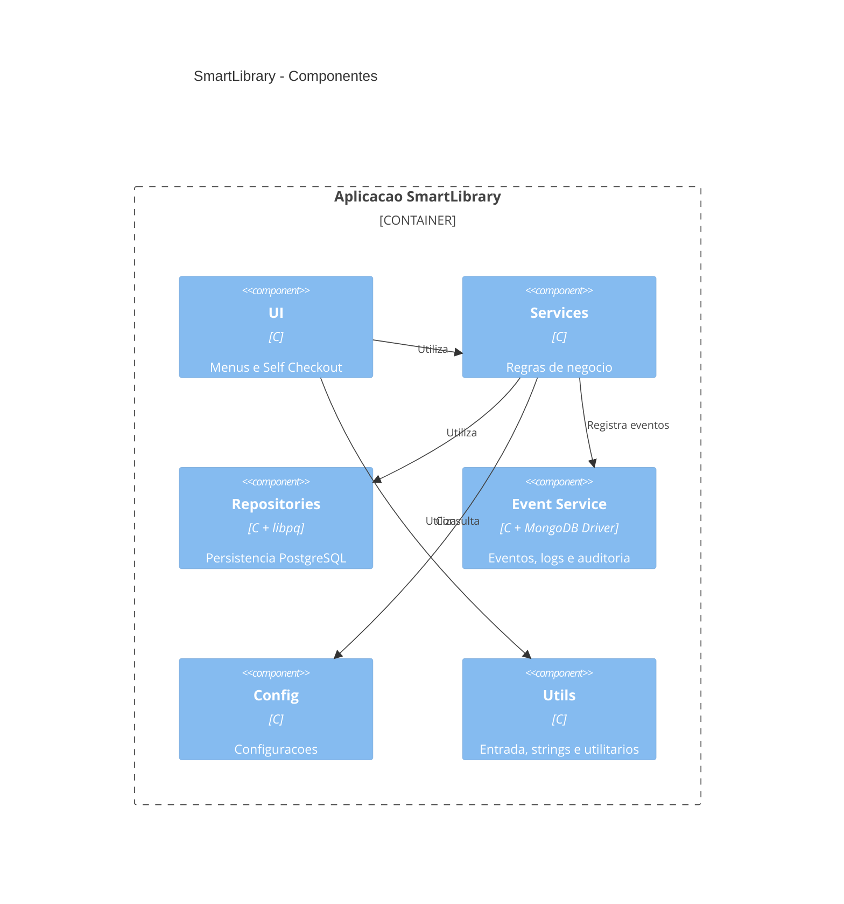

# SmartLibrary - C4 Componentes

```mermaid
C4Component
title SmartLibrary - Componentes
Container_Boundary(app, "Aplicacao SmartLibrary") {
    Component(ui, "UI", "C", "Menus e Self Checkout")
    Component(services, "Services", "C", "Regras de negocio")
    Component(repositories, "Repositories", "C + libpq", "Persistencia PostgreSQL")
    Component(events, "Event Service", "C + MongoDB Driver", "Eventos, logs e auditoria")
    Component(config, "Config", "C", "Configuracoes")
    Component(utils, "Utils", "C", "Entrada, strings e utilitarios")
}
Rel(ui, services, "Utiliza")
Rel(services, repositories, "Utiliza")
Rel(services, events, "Registra eventos")
Rel(ui, utils, "Utiliza")
Rel(services, config, "Consulta")
```
