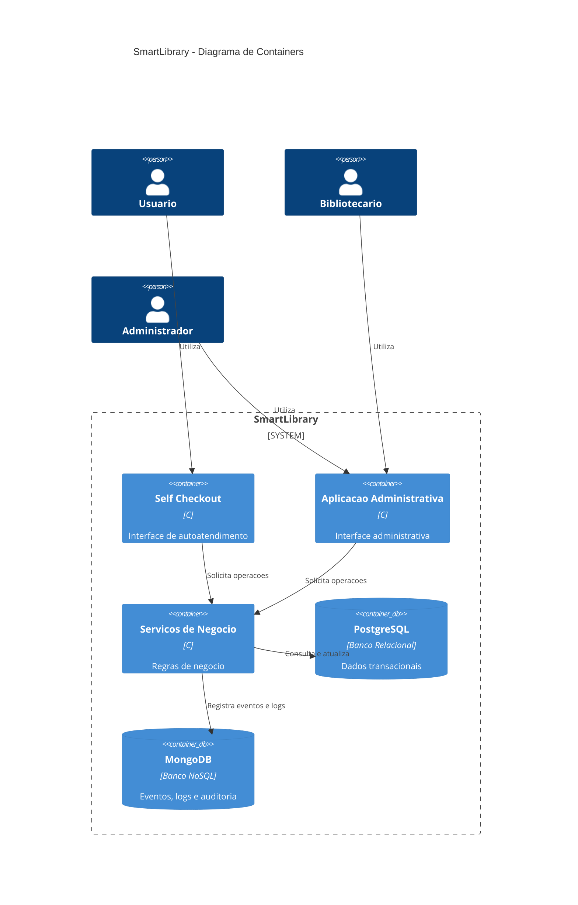

# SmartLibrary - C4 Containers

```mermaid
C4Container
title SmartLibrary - Diagrama de Containers
Person(usuario, "Usuario")
Person(bibliotecario, "Bibliotecario")
Person(administrador, "Administrador")
System_Boundary(smartlibrary, "SmartLibrary") {
    Container(selfcheckout, "Self Checkout", "C", "Interface de autoatendimento")
    Container(adminapp, "Aplicacao Administrativa", "C", "Interface administrativa")
    Container(services, "Servicos de Negocio", "C", "Regras de negocio")
    ContainerDb(postgres, "PostgreSQL", "Banco Relacional", "Dados transacionais")
    ContainerDb(mongodb, "MongoDB", "Banco NoSQL", "Eventos, logs e auditoria")
}
Rel(usuario, selfcheckout, "Utiliza")
Rel(bibliotecario, adminapp, "Utiliza")
Rel(administrador, adminapp, "Utiliza")
Rel(selfcheckout, services, "Solicita operacoes")
Rel(adminapp, services, "Solicita operacoes")
Rel(services, postgres, "Consulta e atualiza")
Rel(services, mongodb, "Registra eventos e logs")
```
