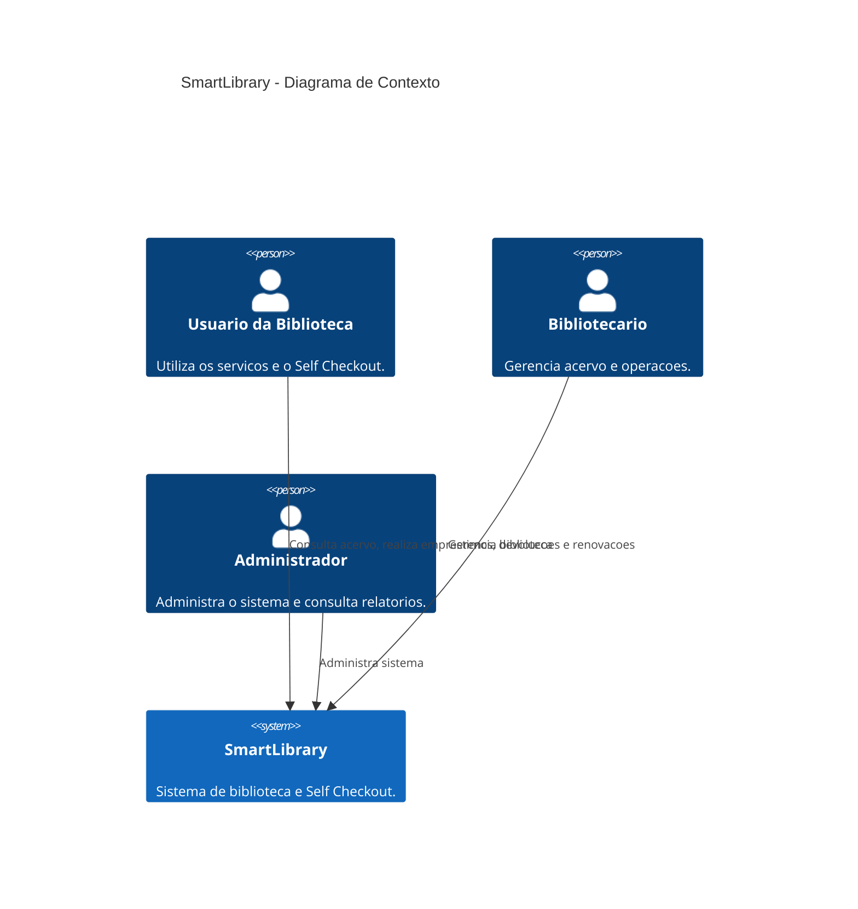

# SmartLibrary - C4 Contexto

```mermaid
C4Context
title SmartLibrary - Diagrama de Contexto
Person(usuario, "Usuario da Biblioteca", "Utiliza os servicos e o Self Checkout.")
Person(bibliotecario, "Bibliotecario", "Gerencia acervo e operacoes.")
Person(administrador, "Administrador", "Administra o sistema e consulta relatorios.")
System(smartlibrary, "SmartLibrary", "Sistema de biblioteca e Self Checkout.")
Rel(usuario, smartlibrary, "Consulta acervo, realiza emprestimos, devolucoes e renovacoes")
Rel(bibliotecario, smartlibrary, "Gerencia biblioteca")
Rel(administrador, smartlibrary, "Administra sistema")
```
