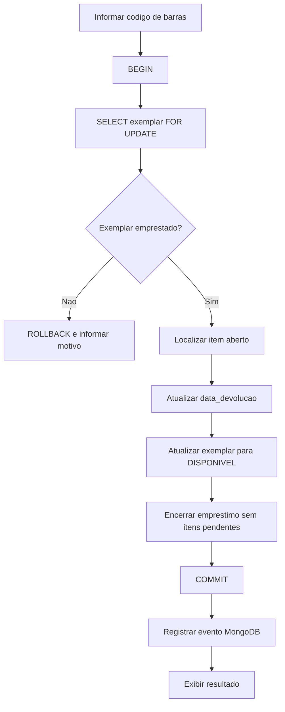

# SmartLibrary - Fluxo De Devolucao

```mermaid
flowchart TD
    A["Informar codigo de barras"] --> B["BEGIN"]
    B --> C["SELECT exemplar FOR UPDATE"]
    C --> D{"Exemplar emprestado?"}
    D -- "Nao" --> X["ROLLBACK e informar motivo"]
    D -- "Sim" --> E["Localizar item aberto"]
    E --> F["Atualizar data_devolucao"]
    F --> G["Atualizar exemplar para DISPONIVEL"]
    G --> H["Encerrar emprestimo sem itens pendentes"]
    H --> I["COMMIT"]
    I --> J["Registrar evento MongoDB"]
    J --> K["Exibir resultado"]
```
