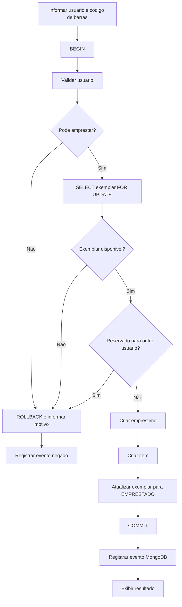

# SmartLibrary - Fluxo De Emprestimo

```mermaid
flowchart TD
    A["Informar usuario e codigo de barras"] --> B["BEGIN"]
    B --> C["Validar usuario"]
    C --> D{"Pode emprestar?"}
    D -- "Nao" --> X["ROLLBACK e informar motivo"]
    D -- "Sim" --> E["SELECT exemplar FOR UPDATE"]
    E --> F{"Exemplar disponivel?"}
    F -- "Nao" --> X
    F -- "Sim" --> G{"Reservado para outro usuario?"}
    G -- "Sim" --> X
    G -- "Nao" --> H["Criar emprestimo"]
    H --> I["Criar item"]
    I --> J["Atualizar exemplar para EMPRESTADO"]
    J --> K["COMMIT"]
    K --> L["Registrar evento MongoDB"]
    L --> M["Exibir resultado"]
    X --> N["Registrar evento negado"]
```
