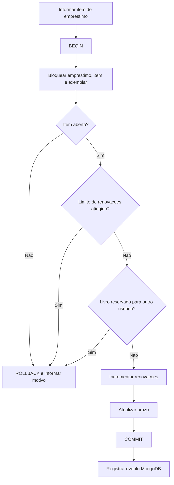

# SmartLibrary - Fluxo De Renovacao

```mermaid
flowchart TD
    A["Informar item de emprestimo"] --> B["BEGIN"]
    B --> C["Bloquear emprestimo, item e exemplar"]
    C --> D{"Item aberto?"}
    D -- "Nao" --> X["ROLLBACK e informar motivo"]
    D -- "Sim" --> E{"Limite de renovacoes atingido?"}
    E -- "Sim" --> X
    E -- "Nao" --> F{"Livro reservado para outro usuario?"}
    F -- "Sim" --> X
    F -- "Nao" --> G["Incrementar renovacoes"]
    G --> H["Atualizar prazo"]
    H --> I["COMMIT"]
    I --> J["Registrar evento MongoDB"]
```
