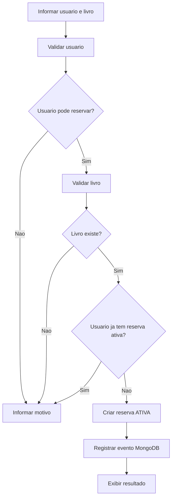

# SmartLibrary - Fluxo De Reserva

```mermaid
flowchart TD
    A["Informar usuario e livro"] --> B["Validar usuario"]
    B --> C{"Usuario pode reservar?"}
    C -- "Nao" --> X["Informar motivo"]
    C -- "Sim" --> D["Validar livro"]
    D --> E{"Livro existe?"}
    E -- "Nao" --> X
    E -- "Sim" --> F{"Usuario ja tem reserva ativa?"}
    F -- "Sim" --> X
    F -- "Nao" --> G["Criar reserva ATIVA"]
    G --> H["Registrar evento MongoDB"]
    H --> I["Exibir resultado"]
```
