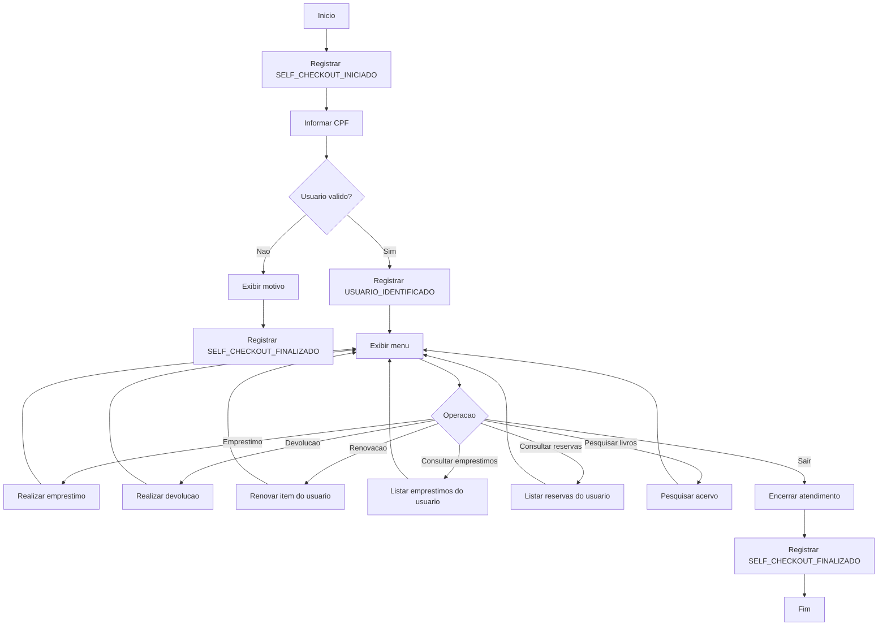

# SmartLibrary - Fluxo Self Checkout

```mermaid
flowchart TD
    A["Inicio"] --> B["Registrar SELF_CHECKOUT_INICIADO"]
    B --> C["Informar CPF"]
    C --> D{"Usuario valido?"}
    D -- "Nao" --> E["Exibir motivo"]
    E --> F["Registrar SELF_CHECKOUT_FINALIZADO"]
    D -- "Sim" --> G["Registrar USUARIO_IDENTIFICADO"]
    G --> H["Exibir menu"]
    H --> I{"Operacao"}
    I -->|Emprestimo| J["Realizar emprestimo"]
    I -->|Devolucao| K["Realizar devolucao"]
    I -->|Renovacao| L["Renovar item do usuario"]
    I -->|Consultar emprestimos| M["Listar emprestimos do usuario"]
    I -->|Consultar reservas| N["Listar reservas do usuario"]
    I -->|Pesquisar livros| O["Pesquisar acervo"]
    I -->|Sair| P["Encerrar atendimento"]
    J --> H
    K --> H
    L --> H
    M --> H
    N --> H
    O --> H
    P --> Q["Registrar SELF_CHECKOUT_FINALIZADO"]
    Q --> R["Fim"]
```
