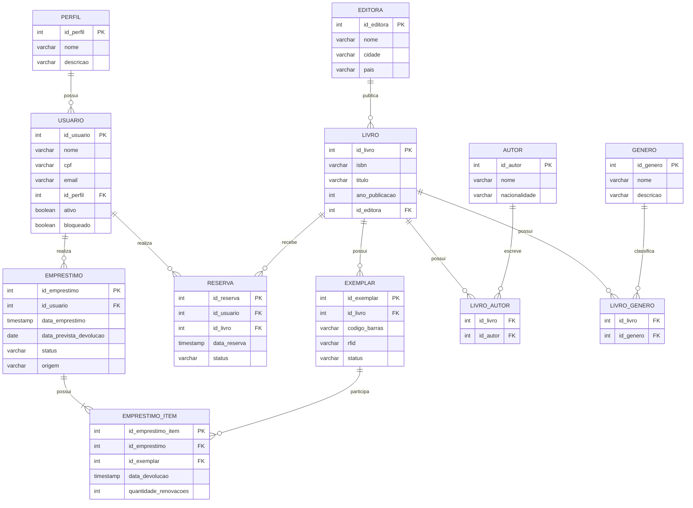

# SmartLibrary - Modelo ER

```mermaid
erDiagram
    PERFIL ||--o{ USUARIO : possui
    USUARIO ||--o{ EMPRESTIMO : realiza
    USUARIO ||--o{ RESERVA : realiza
    EDITORA ||--o{ LIVRO : publica
    LIVRO ||--o{ EXEMPLAR : possui
    LIVRO ||--o{ LIVRO_AUTOR : possui
    AUTOR ||--o{ LIVRO_AUTOR : escreve
    LIVRO ||--o{ LIVRO_GENERO : possui
    GENERO ||--o{ LIVRO_GENERO : classifica
    EMPRESTIMO ||--|{ EMPRESTIMO_ITEM : possui
    EXEMPLAR ||--o{ EMPRESTIMO_ITEM : participa
    LIVRO ||--o{ RESERVA : recebe

    PERFIL { int id_perfil PK varchar nome varchar descricao }
    USUARIO { int id_usuario PK varchar nome varchar cpf varchar email int id_perfil FK boolean ativo boolean bloqueado }
    AUTOR { int id_autor PK varchar nome varchar nacionalidade }
    EDITORA { int id_editora PK varchar nome varchar cidade varchar pais }
    GENERO { int id_genero PK varchar nome varchar descricao }
    LIVRO { int id_livro PK varchar isbn varchar titulo int ano_publicacao int id_editora FK }
    LIVRO_AUTOR { int id_livro FK int id_autor FK }
    LIVRO_GENERO { int id_livro FK int id_genero FK }
    EXEMPLAR { int id_exemplar PK int id_livro FK varchar codigo_barras varchar rfid varchar status }
    EMPRESTIMO { int id_emprestimo PK int id_usuario FK timestamp data_emprestimo date data_prevista_devolucao varchar status varchar origem }
    EMPRESTIMO_ITEM { int id_emprestimo_item PK int id_emprestimo FK int id_exemplar FK timestamp data_devolucao int quantidade_renovacoes }
    RESERVA { int id_reserva PK int id_usuario FK int id_livro FK timestamp data_reserva varchar status }
```
