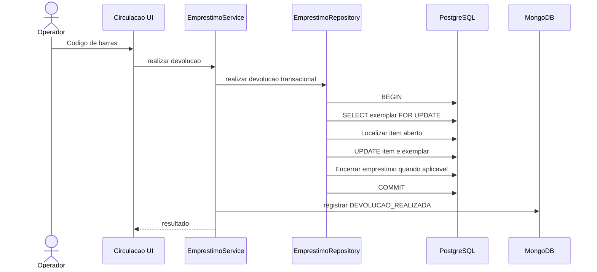

# SmartLibrary - Sequencia De Devolucao

```mermaid
sequenceDiagram
    actor O as Operador
    participant UI as Circulacao UI
    participant S as EmprestimoService
    participant R as EmprestimoRepository
    participant PG as PostgreSQL
    participant MG as MongoDB
    O->>UI: Codigo de barras
    UI->>S: realizar devolucao
    S->>R: realizar devolucao transacional
    R->>PG: BEGIN
    R->>PG: SELECT exemplar FOR UPDATE
    R->>PG: Localizar item aberto
    R->>PG: UPDATE item e exemplar
    R->>PG: Encerrar emprestimo quando aplicavel
    R->>PG: COMMIT
    S->>MG: registrar DEVOLUCAO_REALIZADA
    S-->>UI: resultado
```
