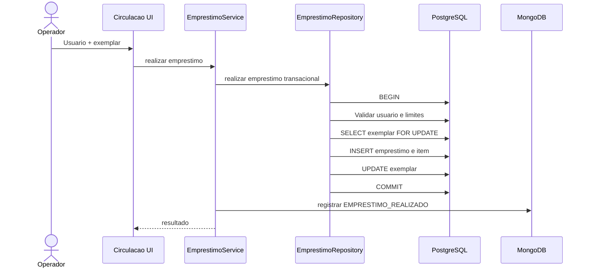

# SmartLibrary - Sequencia De Emprestimo

```mermaid
sequenceDiagram
    actor O as Operador
    participant UI as Circulacao UI
    participant S as EmprestimoService
    participant R as EmprestimoRepository
    participant PG as PostgreSQL
    participant MG as MongoDB
    O->>UI: Usuario + exemplar
    UI->>S: realizar emprestimo
    S->>R: realizar emprestimo transacional
    R->>PG: BEGIN
    R->>PG: Validar usuario e limites
    R->>PG: SELECT exemplar FOR UPDATE
    R->>PG: INSERT emprestimo e item
    R->>PG: UPDATE exemplar
    R->>PG: COMMIT
    S->>MG: registrar EMPRESTIMO_REALIZADO
    S-->>UI: resultado
```
