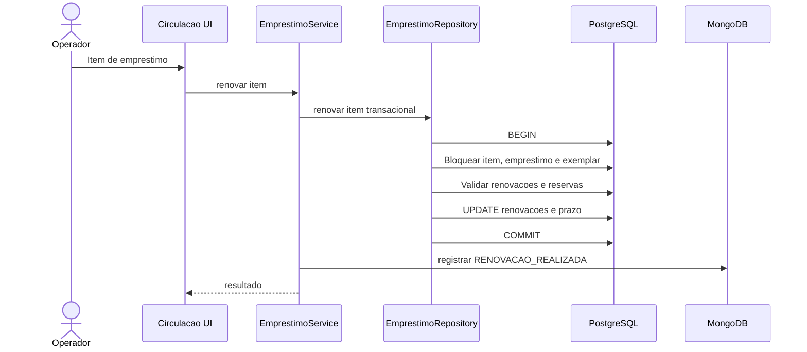

# SmartLibrary - Sequencia De Renovacao

```mermaid
sequenceDiagram
    actor O as Operador
    participant UI as Circulacao UI
    participant S as EmprestimoService
    participant R as EmprestimoRepository
    participant PG as PostgreSQL
    participant MG as MongoDB
    O->>UI: Item de emprestimo
    UI->>S: renovar item
    S->>R: renovar item transacional
    R->>PG: BEGIN
    R->>PG: Bloquear item, emprestimo e exemplar
    R->>PG: Validar renovacoes e reservas
    R->>PG: UPDATE renovacoes e prazo
    R->>PG: COMMIT
    S->>MG: registrar RENOVACAO_REALIZADA
    S-->>UI: resultado
```
