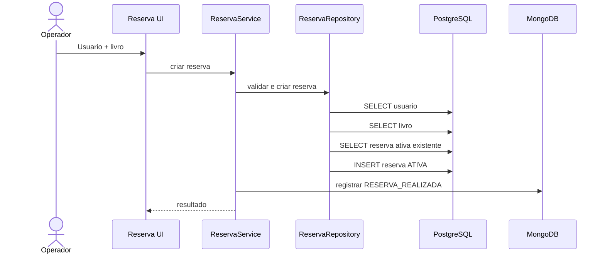

# SmartLibrary - Sequencia De Reserva

```mermaid
sequenceDiagram
    actor O as Operador
    participant UI as Reserva UI
    participant S as ReservaService
    participant R as ReservaRepository
    participant PG as PostgreSQL
    participant MG as MongoDB
    O->>UI: Usuario + livro
    UI->>S: criar reserva
    S->>R: validar e criar reserva
    R->>PG: SELECT usuario
    R->>PG: SELECT livro
    R->>PG: SELECT reserva ativa existente
    R->>PG: INSERT reserva ATIVA
    S->>MG: registrar RESERVA_REALIZADA
    S-->>UI: resultado
```
