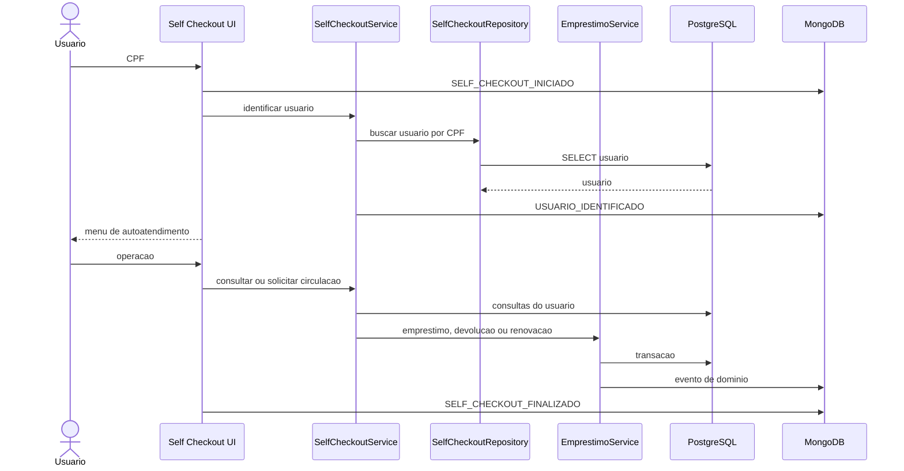

# SmartLibrary - Sequencia Self Checkout

```mermaid
sequenceDiagram
    actor U as Usuario
    participant UI as Self Checkout UI
    participant S as SelfCheckoutService
    participant R as SelfCheckoutRepository
    participant C as EmprestimoService
    participant PG as PostgreSQL
    participant MG as MongoDB
    U->>UI: CPF
    UI->>MG: SELF_CHECKOUT_INICIADO
    UI->>S: identificar usuario
    S->>R: buscar usuario por CPF
    R->>PG: SELECT usuario
    PG-->>R: usuario
    S->>MG: USUARIO_IDENTIFICADO
    UI-->>U: menu de autoatendimento
    U->>UI: operacao
    UI->>S: consultar ou solicitar circulacao
    S->>PG: consultas do usuario
    S->>C: emprestimo, devolucao ou renovacao
    C->>PG: transacao
    C->>MG: evento de dominio
    UI->>MG: SELF_CHECKOUT_FINALIZADO
```
